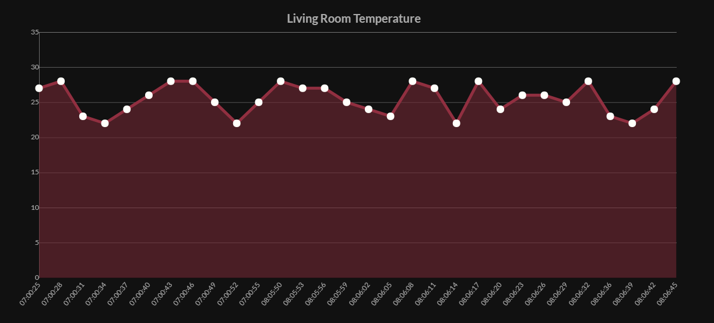

# Temperature-Monitor-Chart

This app fetches the latest temperature data saved by the backend app. See [node-postgresql-mqtt](https://github.com/WISE-PaaS/node-postgresql-mqtt) and [edge-mock-temperature](https://github.com/WISE-PaaS/edge-mock-temperature). It displays the data using [Chart.js](https://www.chartjs.org/samples/latest/).

## Screenshot

